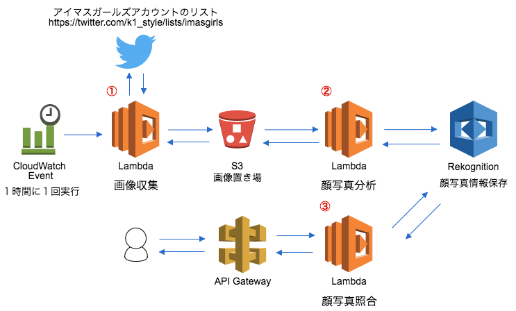

# アイマスガールズ写真照合

## 全体像



## 導入方法

### 前提

以下アカウントを作成していること
* <a href="https://aws.amazon.com/jp/iam/" target="_blank">AWS (IAMユーザー)</a>
* <a href="https://twitter.com/" target="_blank">Twitter</a>

以下インストール済みであること

* <a href="https://aws.amazon.com/jp/cli/" target="_blank">AWS コマンドラインインターフェイス（CLI - AWS サービスの制御・管理）｜AWS</a>
* <a href="https://nodejs.org/ja/" target="_blank">Node.js</a>
* <a href="https://git-scm.com/" target="_blank">Git</a>

### リポジトリクローン && npmパッケージインストール

```
$ git clone https://github.com/K1-Style/imasgirls-photo-rekognition
$ cd imasgirls-photo-rekognition
$ npm install
```

### 環境変数設定

`.envrc_sample`の内容を参考に、環境変数を予めセットしてください。

TwitterのCONSUMER_KEYなど各種クレデンシャル情報については、https://apps.twitter.com/ にてアプリケーションを作成し準備してください。

### Rekognitionの顔情報保存用Collection作成

```
$ aws rekognition create-collection --collection-id $REKOGNITION_COLLECTION_ID
```

### デプロイ

```
$ npm run deploy
```
デプロイ成功すると顔写真照合時に使用するAPI Gatewayで作成したエンドポイントURIドメインが合わせて出力されます。


## 顔写真照合の実行方法

```
$ curl -H "Content-Type: image/jpeg" --data-binary "@<画像ファイルパス>" -X POST <API Gatewayで作成したエンドポイントURIドメイン>/dev/match_faces
```

レスポンスjson↓
```
{
  "result": "OK",
  "matchedFaces": [
    {
      "Similarity": 78.88072967529297,
      "Face": {
        "FaceId": "48d9d926-9163-47f6-a2f6-5c3f6bfef00b",
        "BoundingBox": {
          "Width": 0.046875,
          "Height": 0.03515620157122612,
          "Left": 0.29166701436042786,
          "Top": 0.40625
        },
        "ImageId": "1aa12926-0f98-5413-b5af-266ad564c10d",
        "ExternalImageId": "939154187413159936_kanekosanndesu_0.jpg",
        "Confidence": 99.99849700927734
      }
    },
    {...}
   ],
  "stackTrace": null
}
```
`ExternalImageId`がS3で保存された元の写真ファイル名となります。
その他のレスポンス情報については公式のドキュメントを参考にしてみてください。
http://docs.aws.amazon.com/AWSJavaScriptSDK/latest/AWS/Rekognition.html#searchFacesByImage-property
